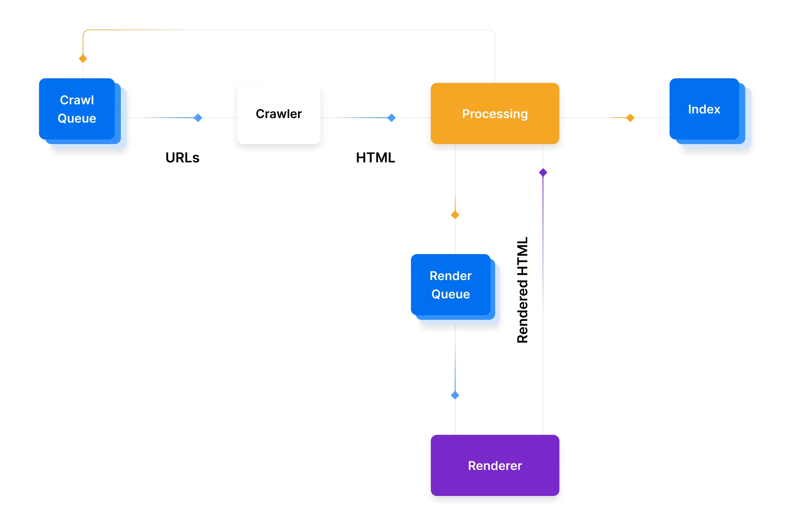
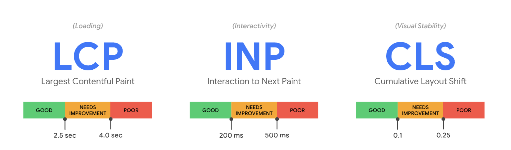
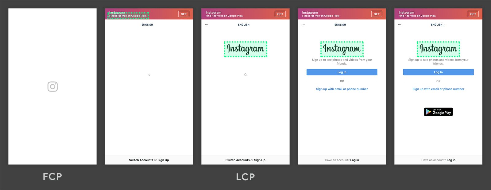
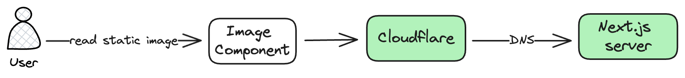
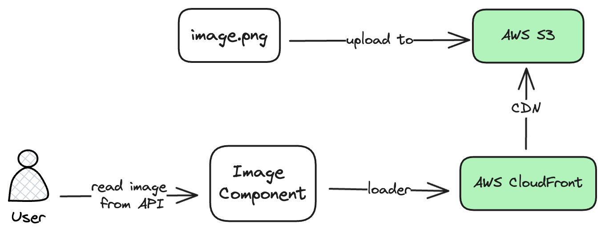

# 從 Next.js 的角度了解如何優化 Web Vital

2024/08/05 Leo Chiu

<div class="pt-12">
  <span @click="$slidev.nav.next" class="px-2 py-1 rounded cursor-pointer" hover="bg-white bg-opacity-10">
    Press Space for next page <carbon:arrow-right class="inline"/>
  </span>
</div>

<div class="abs-br m-6 flex gap-2">
  <button @click="$slidev.nav.openInEditor()" title="Open in Editor" class="text-xl slidev-icon-btn opacity-50 !border-none !hover:text-white">
    <carbon:edit />
  </button>
  <a href="https://github.com/slidevjs/slidev" target="_blank" alt="GitHub" title="Open in GitHub"
    class="text-xl slidev-icon-btn opacity-50 !border-none !hover:text-white">
    <carbon-logo-github />
  </a>
</div>


---
transition: fade-out
---

# Outline


- 搜尋引擎簡介
- Core Web Vital 簡介
- 如何在 Next.js 中優化 Core Web Vital
- 如何監控 Core Web Vital
- 總結


<style>
h1 {
  background-color: #2B90B6;
  background-image: linear-gradient(45deg, #4EC5D4 10%, #146b8c 20%);
  background-size: 100%;
  -webkit-background-clip: text;
  -moz-background-clip: text;
  -webkit-text-fill-color: transparent;
  -moz-text-fill-color: transparent;
}
</style>

<!--
Here is another comment.
-->

---
transition: slide-up
---

# 搜尋引擎簡介

<div class="grid grid-cols-2 gap-6">

<div>

搜尋引擎有很多家，但主要都會分成四個流程：

<v-clicks>

- **Crawling:** 訪問全世界所有的網站，並且爬到網站中的內容
- **Indexing:** 將網站內容儲存到搜尋引擎資料庫的過程，讓網站可以容易的被搜尋引擎檢索、排序
- **Rendering:** 執行網站上的任何資源，例如 JavaScript
- **Ranking:** 根據使用者在瀏覽器輸入的資料從搜尋引擎資料庫檢索資料，並給予使用者最想要在搜尋引擎上看到的結果

</v-clicks>

</div>



</div>

---
transition: slide-up
---

# Web Crawler

- Web crawlers 有很多種類別，會根據 user-agents 來判斷要使用哪種類別的 web crawler
- Google 最常使用 Googlebot Desktop 與 Googlebot Smartphone

根據不同的需求設定 robot.txt，以新聞業來說可以設定只有 `googlebot-new` 可檢索整個網站：


```
User-agent: Googlebot-news
Allow: /

User-agent: *
Disallow: /
```


---
transition: slide-left
---

# SEO

### 為什麼要優化 SEO:

<v-clicks>

1. **Qualitative:** 提升轉換率，讓來訪的使用者變成客戶
2. **Trustable:** 提升品牌信任務與知名度
3. **Low-Cost:** 不一定要課金使用廣告也可以讓網站的曝光度提高

<br>

### 如何優化 SEO:

1. **Technical:** 優化網站，例如優化 Core Web Vital
2. **Creation:** 使用好的內容策略，讓網站可以被關鍵字打到
3. **Popularity:** 讓搜尋引擎認為你的網站是一個可被信任的來源，例如透過 backlink，讓其他網站返回至你的網站

</v-clicks>


---
transition: slide-up
---

# Web Vital

<div>
Web Vital (網站體驗指標) 是一個 Google 推出的計畫，針對良好的網站使用者體驗提供統一的指標。

<span v-mark.underline.orange="1">Core Web Vitals 是 Web vital 計畫的一部分</span>，適用於所有網頁，分成 3 個指標：

- [Largest Contentful Paint (LCP)](https://web.dev/articles/lcp?hl=zh-tw)：評估載入效能
- [Interaction to Next Paint (INP)](https://web.dev/inp?hl=zh-tw)：評估回應速度
- [Cumulative Layout Shift (CLS)](https://nextjs.org/learn/seo/web-performance/cls)：測量視覺穩定性



</div>

<style>
  img {
    height: 150px;
  }
</style>

---
transition: slide-up
---

# Largest Contentful Paint (LCP)

<div>
LCP 主要是評估網站的<span v-mark.circle.orange="1">載入效能</span>，會關注在網頁中最大的區塊出現在畫面上的時間，這個區塊可能是一個很長的文字區塊、影片、圖片等等。<strong>網站應力求達到 2.5 秒或更短的 LCP 時間，至少佔 75% 的頁面造訪次數。</strong>



</div>

<v-click at="+2">

優化策略：

- 優化 <span v-mark.underline.orange="1">Time To First Byte(TTFB)</span>，因為如果伺服器很慢，也會影響後續的 LCP 分數
- 優化 <span v-mark.underline.orange="1">First Content Paint(FCP)</span>，例如合成 CSSOM、DOM tree 時花費太多時間，進而影響了 LCP 分數
- 優化下載的檔案，例如檔案大小、檔案格式

</v-click>


---
transition: slide-up
---

# Interaction to Next Paint (INP)

<div>

INP 指標會觀察使用者在造訪頁面期間，在整個造訪期間發生的<span v-mark.circle.orange="1">所有點擊、輕觸和鍵盤互動延遲</span>，藉此評估網頁對使用者互動的整體反應。

<video src="./images//WSmcjiQC4lyLxGoES4dd.mp4" autoplay width="700" loop/>

<v-click at="+2">

優化策略：

- 使用 CrUX 資料集來優化 INP
- 減少 main thread 阻塞

</v-click>

</div>

---
transition: slide-up
---

# Cumulative Layout Shift (CLS)

<div>

CLS 主要在評估<span v-mark.circle.orange="1">視覺穩定性</span>，在畫面渲染之後造成區塊移動會讓使用者感到不便，例如原本欲點擊的按鈕在圖片區塊渲染之後被往下推移了。

<div class="grid grid-cols-2">

<video src="./images/layout-instability2.mp4" autoplay width="400" loop/>

<div>

<v-click at="+2">

優化策略:

- 讓圖片有尺寸
- 為嵌入的廣告、iframe 留有空間
- 將嵌入的元素往下放，減少 CLS 的影響
- 避免使用 `top`、`left` 來建立動畫，儘管是 `position: absolute`

</v-click>

</div>

</div>

</div>


---
transition: slide-left
---

# 優化 Core Web Vitals 的策略

主要可以分成兩個策略：

<v-clicks>

1. <span v-mark.underline.orange="1">盡可能優化網站達到最高的分數</span>，但是很大的產品可能較難優化，因為會有像是人力、時間、成本等等的因素影響
2. <span v-mark.underline.orange="2">跟競品比較分數</span>，因為競品不一定也獲得非常高的分數，優化 Core Web Vitals 的其中一個目標是在搜尋引擎排名上勝過競品。如果是在藍海市場，也許不用在意 SEO，營運也可以有非常好的成效

</v-clicks>


---
transition: slide-up
---

# 在 Next.js 中優化 Core Web Vitals

<div>

Core Web Vitals 的三個指標：

- [Largest Contentful Paint (LCP)](https://web.dev/articles/lcp?hl=zh-tw)：評估載入效能
- [Interaction to Next Paint (INP)](https://web.dev/inp?hl=zh-tw)：評估回應速度
- [Cumulative Layout Shift (CLS)](https://nextjs.org/learn/seo/web-performance/cls)：測量視覺穩定性

</div>


---

# 使用 `next/image` 優化

<div>

- Image component 主要是用來解決 LCP 的問題
- (LCP) 支援 WebP 現代圖片格式，普遍比傳統 JEPG、PNG 更小
- (LCP) 默認啟用 lazy loading，進而讓其他資料載入更快
- 應須優化圖片，在使用者請求該圖片時才優化，而不是在 build time 時優化
- 避免 Cumulative Layout Shift (CLS)

```typescript
import Image from 'next/image'
 
export default function Page() {
  return (
    <div>
      <Image
        src="/profile.png"
        width={500}
        height={500}
        alt="Picture of the author"
      />
    </div>
  )
}
```

</div>

---

# 2B 如何使用 Image Component - 靜態圖片



<div class="grid grid-cols-2 gap-5 pt-6">

<v-clicks>

<div>
第一次讀取圖片：

1. 透過 Image Component 讀取圖片
2. Cloudflare 會看邊緣伺服器有沒有暫存，因為沒有暫存，所以會再跟 Next.js 伺服器請求圖片
3. Next.js 伺服器會在 request time 優化圖片，並且回傳到 Cloudflare 伺服器
4. Cloudflare 伺服器收到圖片後再次優化圖片（目前只有開轉檔，但因為已經轉檔過，所以不用再次轉檔），最後回傳給使用者
</div>

<div>
第二次讀取圖片：

1. 透過 Image Component 讀取圖片
3. Cloudflare 會看邊緣伺服器有沒有暫存，因為有暫存，所以會直接回傳暫存的圖片。如果超過 maxAge 則是會再次進行第一次讀取圖片的流程
</div>

</v-clicks>

</div>

--- 

# 2B 如何使用 Image Component - 從 API 取得的資料

<div class="grid grid-cols-2 gap-5 pt-6">

<div>
 
1. 透過 Image Component 的 loader 讀取圖片。由於使用 loader，所以不會有圖片優化的過程
2. 根據 loader 的定義，會從 CDN（AWS CloudFront）讀取圖片



</div>


```typescript

import Image from 'next/image'
 
const imageLoader = ({ src, width, quality }) => {
  return `https://example.com/${src}?w=${width}&q=${quality || 75}`
}
 
export default function Page() {
  return (
    <Image
      loader={imageLoader}
      src="me.png"
      alt="Picture of the author"
      width={500}
      height={500}
    />
  )
}
```

</div>

---

# 回顧 Image Component 優化的項目

<v-clicks>

- 使用 WebP 格式、Lazy loading 等等功能加速了資源的載入，進而降低 LCP
- Image component 預設的情況下會使用 `position: absolute` 避免 CLS
- 在 2B 的架構中透過第三方服務代理的架構來達到優化 Time To First Byte (TTFB)
  - 靜態圖片會由 CloufFlare 代理 DNS，讓圖片的資源可以在 edge server 讀取，加速讀取速度
  - API 中的圖片都是從 AWS S3 讀取，AWS S3 的資源會由 CloudFront CDN 代理，讀取速度會更快

</v-clicks>

<!-- ---

# 在 next.js 中優化 INP

INP 為以下三個延遲分數的加總：

- Input Delay（輸入延遲）: 用戶互動和瀏覽器處理事件之間的時間。
- Processing Delay（處理延遲）: 瀏覽器處理事件處理程序所需的時間。
- Presentational Delay（呈現延遲）: 瀏覽器重新計算佈局並將像素繪製到螢幕上所需的時間。

優化的方式：

- 使用 `debounce` 或 `throttle` 在執行頻繁的事件中
- Code Splitting、tree shaking 減少不必要的 JavaScript
- 使用有效率的 CSS 屬性，
  - `will-change`: 它可以告訴瀏覽器哪些元素將要發生改變，進而優化這些元素的渲染方式。
  - `transform`、`opacity`: 使用在動畫上，減少排版重新計算
  - `content-visibility`: 可以達到類似 lazy loading 的效果，在視窗外的元素就不會渲染，但是跟 lazy loading 不一樣的是靜態資源仍然會下載

、`transform`

React 18 的 concurrent mode :

- Concurrent Rendering: 在複雜的狀態變化時，仍然可以順暢的更新畫面
- Automatic Batching: 批次更新狀態可以減少 main thread 的計算量
- Suspense for Data Fetching: 將畫面切分成許多碎片，讓畫面的呈現不阻塞
- useTransition Hook: 用來避免狀態更新阻塞畫面渲染 -->

--- 

# 使用 `next/font` 優化

- 提供字型預加載的功能，可減少字型加載時間對 First Content Paint (FCP) 的影響
- 使用 `font-display: swap` 與 `size-adjust`，減少 layout 位移，進而降低 CLS 的分數


```typescript
import { Inter } from 'next/font/google'
 
// If loading a variable font, you don't need to specify the font weight
const inter = Inter({
  subsets: ['latin'],
  display: 'swap',
})
 
export default function RootLayout({
  children,
}: {
  children: React.ReactNode
}) {
  return (
    <html lang="en" className={inter.className}>
      <body>{children}</body>
    </html>
  )
}
```

--- 

# 使用 `next/dynamic` 優化

Dynamic import 主要是透過 lazy loading 來提升網頁效能。

- 確保最重要的資源被優先加載，進而改善 LCP
- 由於減少了資源的加載，所以改善了 processing delay，INP 的分數也會因此改善

Dynamic import module:

```jsx
const _ = (await import('lodash')).default;
```

Dynamic import component:

```jsx
import dynamic from 'next/dynamic';

const CodeSampleModal = dynamic(() => import('../components/CodeSampleModal'), {
  ssr: false,
});
```

---

# 使用 `next/script` 優化

Next.js 提供的 Script Component 支援 `strategy` 屬性，讓你可以控制第三方套件的載入時機。為了避免對 LCP、INP 產生負面影響，預設使用 `afterInteractive`。

- `strategy="afterInteractive"`（default），在頁面 hydration 之後
- `strategy="lazyOnload"` 在瀏覽器閒置的時候
- `strategy=”worker”` 這是個實驗性的功能，可以在 web worker 載入 script

```jsx
import Script from 'next/script';

<Script
  strategy="afterInteractive"
  src="https://www.googletagmanager.com/gtag/js?id=123"
/>
```
---

# App router

<v-clicks>

<div>

Component:
- Server Component
- Client Component

</div>

<div>

Rendering:

- Static Rendering
- Dynamic Rendering
- Streaming Rendering

</div>

<div>

Cache:

- Request Memoization
- Data Cache
- Full Route Cache
- Router Cache

</div>

</v-clicks>


--- 

# Server Component Rendering

Server:

1. 在伺服器渲染 Server Component 生成 <span v-mark.underline.orange="0">Server Component Payload (RSC Payload)</span>
2. Next.js 使用 RSC Payload 跟 client component 在伺服器生成 HTML

Client:

1. 在瀏覽器生成一個沒有任何互動的頁面
2. RSC payload 會跟 Client、Server Component 進行 reconcile，更新 DOM
3. 執行 hydration client component，讓元件可以互動


--- 

# Static Rendering、Dynamic Rendering 與 Streaming Rendering

| | |
|-|-|
|Static Rendering|<span v-mark.underline.orange="0">在預設的情況下頁面會是 static rendering</span>，打 API 獲取資料與頁面渲染會在 build time 執行，或是執行 revalidate data 的時候執行|
|Dynamic Rendering|頁面資料是即時性的，每次請求時會重新抓取資料|

<v-click>
<div>

一般情況下不用去思考該用 Static Rendering 還是用 Dynamic Rendering，Next.js 會自動根據實作的方式決定要用哪一種渲染方式，例如判斷使用 `searchParams` 或 `cookies()` 時會將 route 轉成 Dynamic Rendering

</div>
</v-click>

<v-click>

<span v-mark.underline.orange="0">Streaming Rendering 是 Next.js 預設的功能</span>，使用 `loading.ts` 或是 React Suspense 就可以讓頁面中的區塊以 streaming 的方式送至 client

</v-click>

<style>
  td:first-of-type {
    white-space: nowrap;
  }
</style>

--- 

# Cache

| 機制 | 快取了什麼 | 位置 | 目的 | 時機 |
| --- | --- | --- | --- | --- |
| Request Memoization | function 的返回值 | Server | 在 React 元件樹中重複使用數據 | 每次請求的生命週期 |
| Data Cache | 數據 | Server | 在用戶請求和部署之間存儲數據 | 持久性（can revalidate） |
| Full Route Cache | HTML 和 RSC Payload | Server | 減少渲染成本並提高性能 | 持久性（can revalidate） |
| Router Cache | RSC Payload | Client | 減少 navigation 時的伺服器請求 | User session or time-based |

<style>
  td:first-of-type {
    white-space: nowrap;
  }
</style>

---

# App router 對於 Core Web Vitals 的影響

|App router 的實作|影響的 Core Web Vitals|
|-|-|
|Server Component Rendering 搭配 Cache 讓伺服器負責渲染渲染工作|LCP|
|Streaming Rendering 讓頁面不會等待所有的資料都抓到之後才渲染頁面|LCP|
|因為 Server Component 作為 code-splitting 的界線，對於 page router code-splitting by per router 的實作，能夠讓 client 下載更少的資源|LCP、INP|
|App router 擁有 React 18 有的功能，包括 Concurrent Rendering、Automatic Batching、Suspense for Data Fetching、`useTransition` 都可以避免 blocking main thread|INP|

<!-- 
- Concurrent Rendering: 在複雜的狀態變化時，仍然可以順暢的更新畫面
- Automatic Batching: 批次更新狀態可以減少 main thread 的計算量
- Suspense for Data Fetching: 將畫面切分成許多碎片，讓畫面的呈現不阻塞
- useTransition Hook: 用來避免狀態更新阻塞畫面渲染 -->


<style>
  td:last-of-type {
    white-space: nowrap;
  }
</style>

---

# 總結

- 認識了搜尋引擎、SEO、Core Web Vitals
- 了解 Next.js 對 Core Web Vitals 的優化方法
- 了解 app router 對於 Core Web Vitals 有什麼影響


---
layout: center
---

# Instagram & Threads: @leo.web.dev

---
layout: center
---

# Thank you for listening!
